# SIGAP 6502 - Sistem Informasi Pengingat Presensi

SIGAP 6502 adalah aplikasi monitoring dan administrasi pengingat presensi berbasis WhatsApp untuk tim internal BPS Kabupaten Bulungan. Aplikasi ini menyatukan status bot, jadwal kirim, pengumuman, template pesan, dan data kontak dalam satu panel yang konsisten.

## Overview

SIGAP 6502 dibangun sebagai monorepo `backend` + `frontend` untuk kebutuhan operasional pengingat presensi harian.

Aplikasi ini ditujukan untuk:

- Admin operasional yang mengelola jadwal, kontak, dan konten pesan.
- Tim internal yang membutuhkan visibilitas status layanan secara real-time.
- Pengguna publik internal yang perlu melihat status layanan tanpa login.

Nilai utama yang diberikan:

- Kontrol operasional terpusat dari satu dashboard admin.
- Monitoring bot dan jadwal yang transparan.
- Manajemen data pengingat (kontak, kalender, template, kutipan) yang rapi dan terstruktur.

## Fitur Utama

- Dashboard admin operasional dengan ringkasan status bot, jadwal, log, dan pengiriman berikutnya.
- Login admin berbasis sesi untuk membatasi akses pengelolaan.
- Manajemen kontak pegawai (tambah, edit, hapus, update status, aksi massal).
- Manajemen kalender libur dan cuti bersama.
- Manajemen template pesan dengan placeholder dinamis `{name}` dan `{quote}`.
- Manajemen kutipan harian untuk kebutuhan isi pesan.
- Halaman publik status layanan (`/`) untuk melihat status bot, aktivitas, statistik, dan jadwal.
- Dukungan Light Mode dan Dark Mode pada halaman publik dan admin.
- Halaman error yang jelas untuk kondisi `404` dan `500`.

## Preview Aplikasi

### Dashboard

- Light Mode

  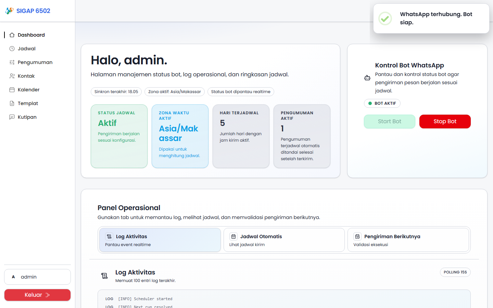
- Dark Mode

  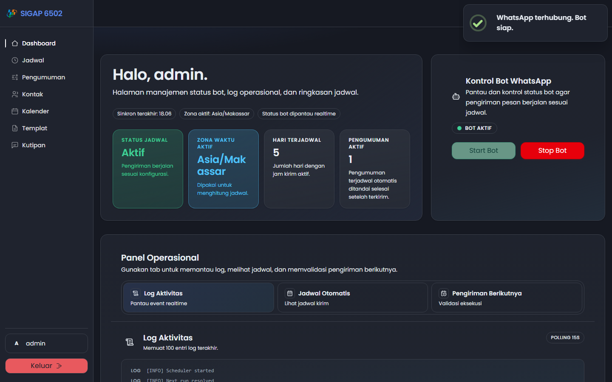

### Login

- Light Mode

  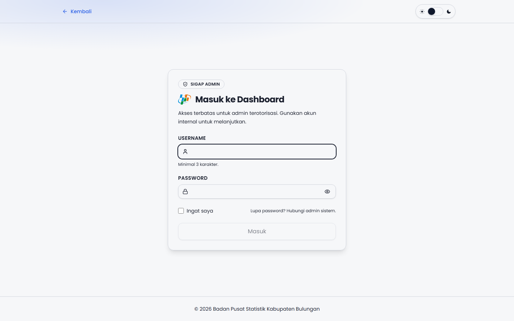
- Dark Mode

  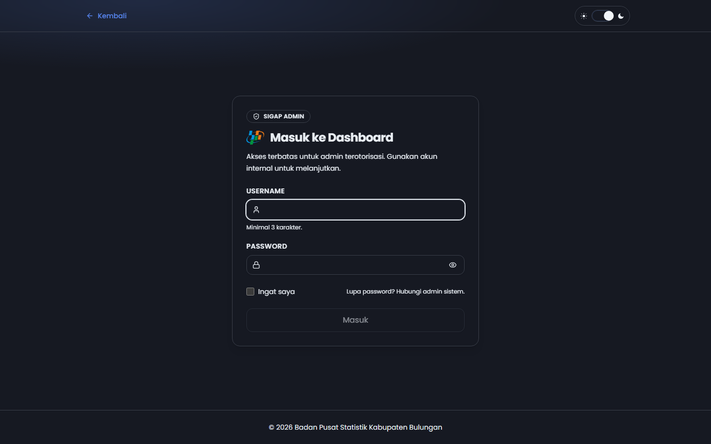

### Kalender

- Light Mode

  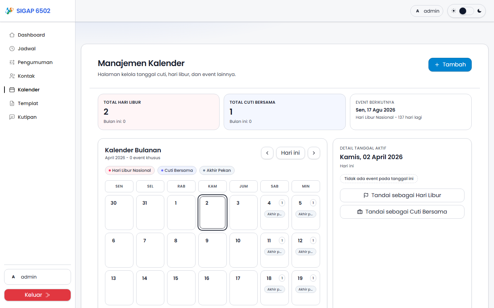
- Dark Mode

  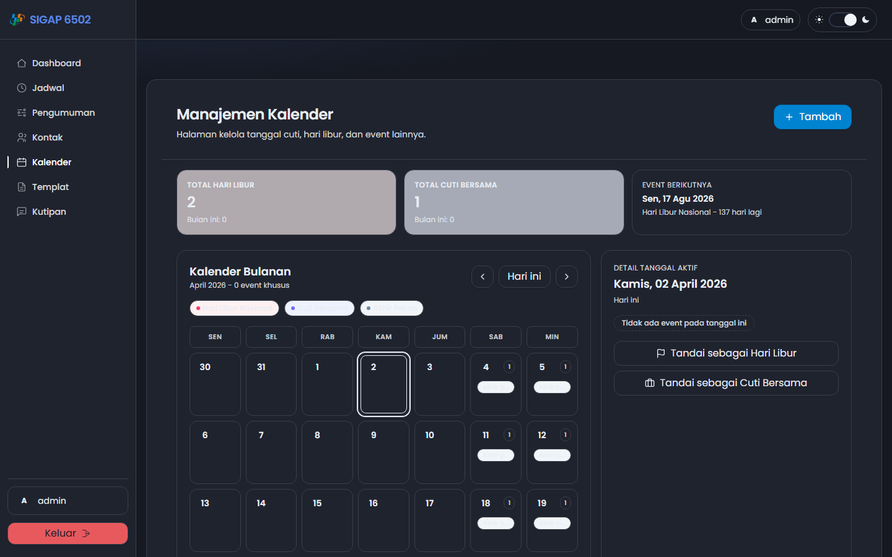

### Kontak

- Light Mode

  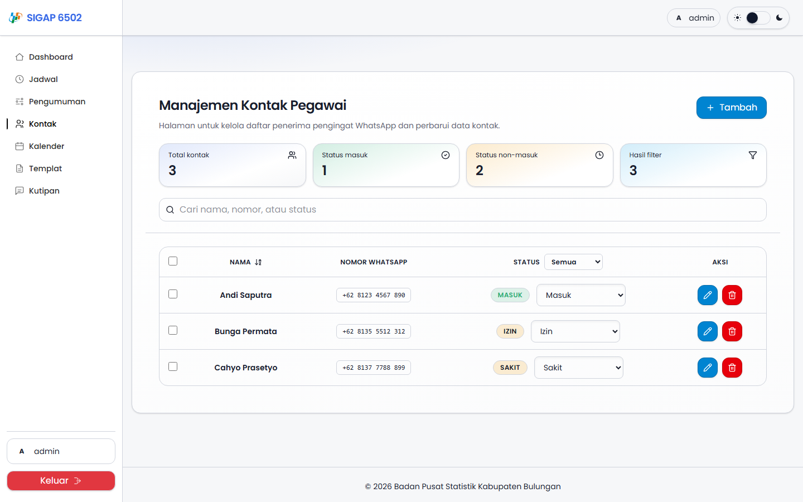
- Dark Mode

  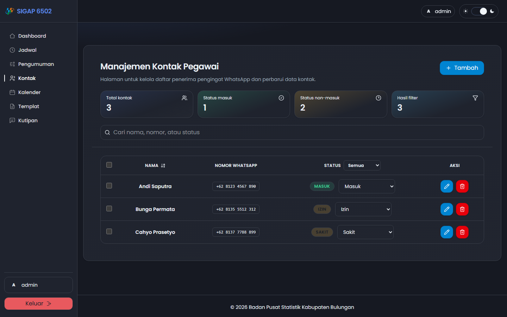

### Templat

- Light Mode

  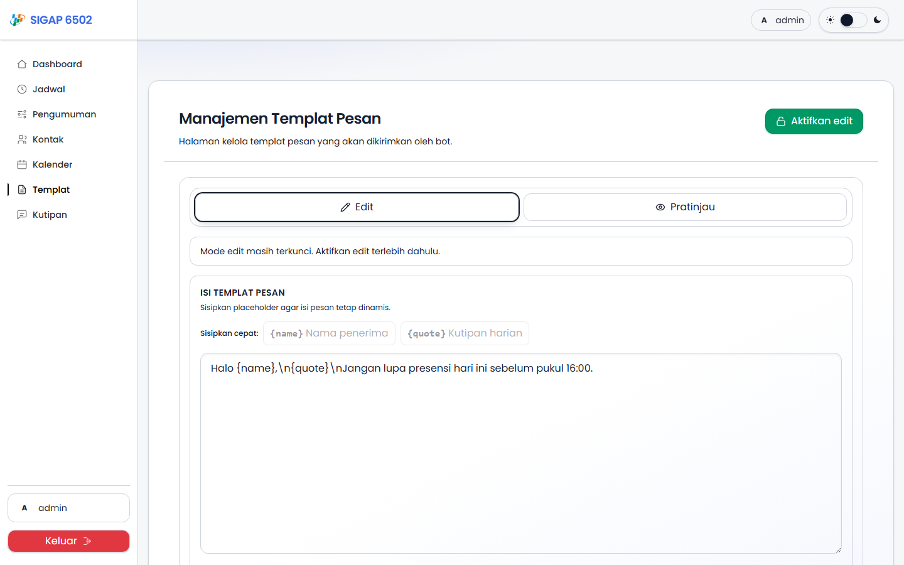
- Dark Mode

  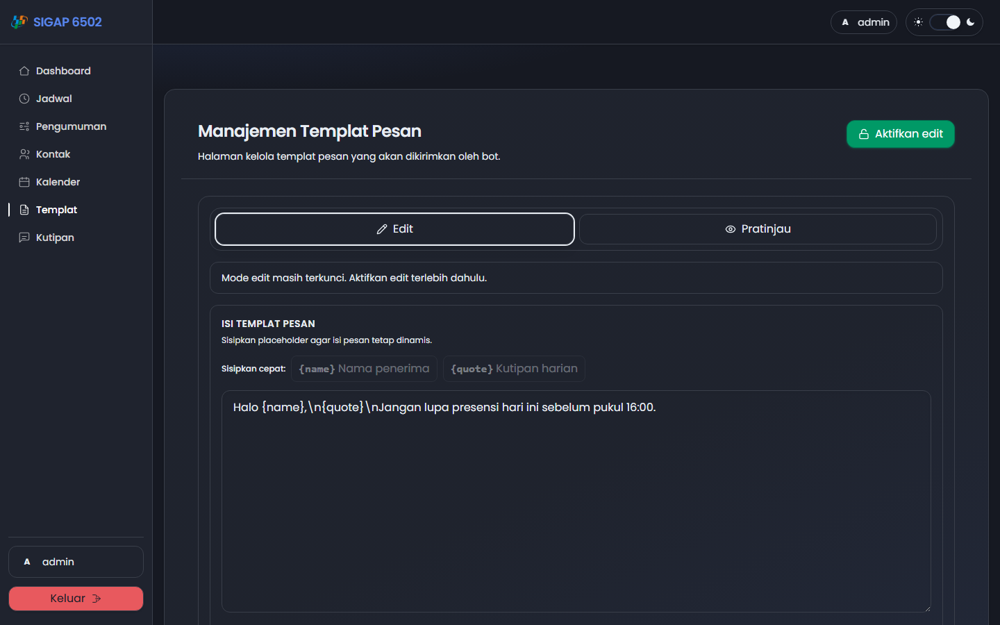

### Kutipan

- Light Mode

  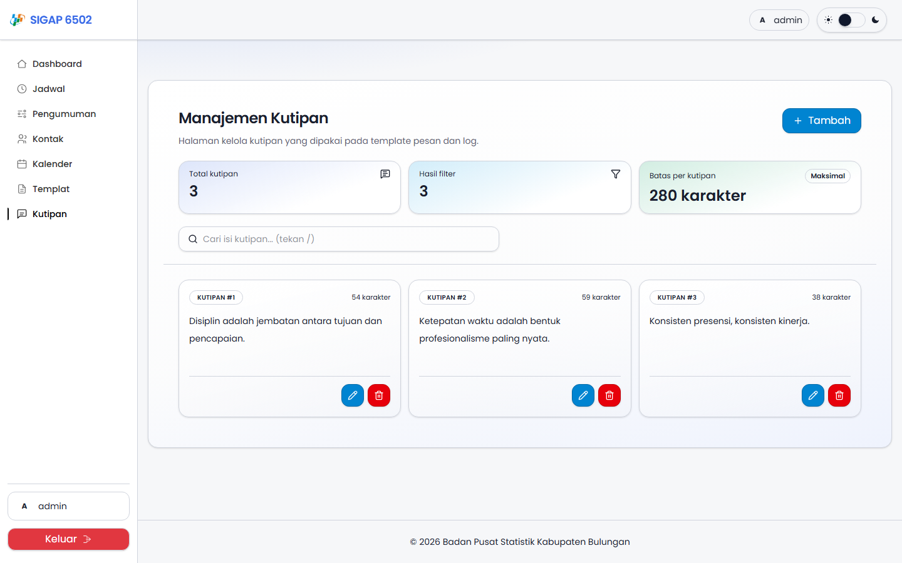
- Dark Mode

  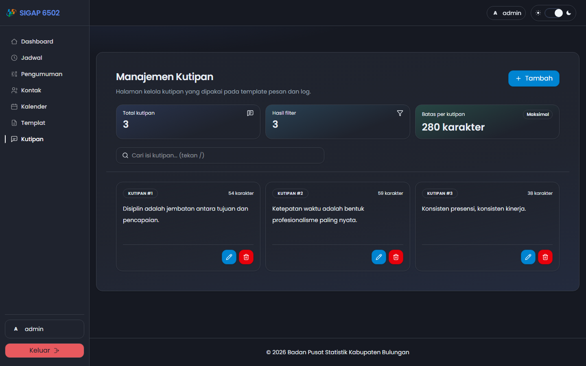

### Public Home

- Light Mode

  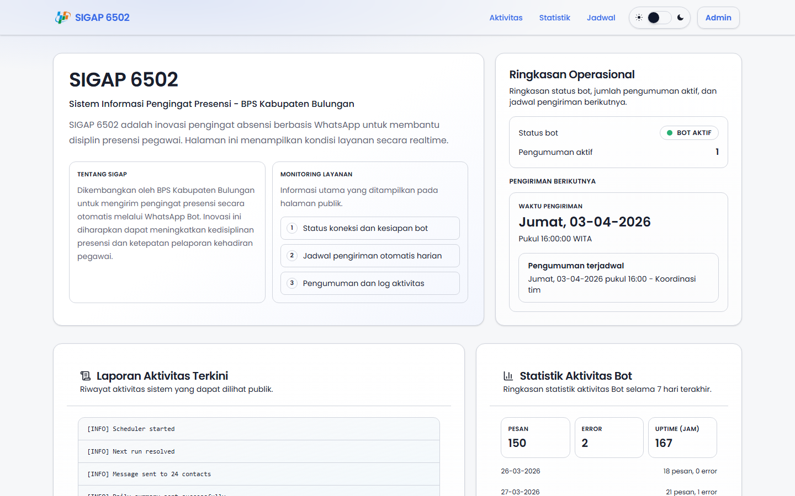
- Dark Mode

  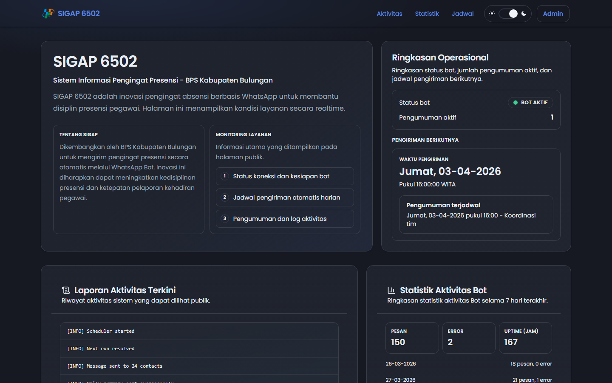

### Error Pages

- Error 404

  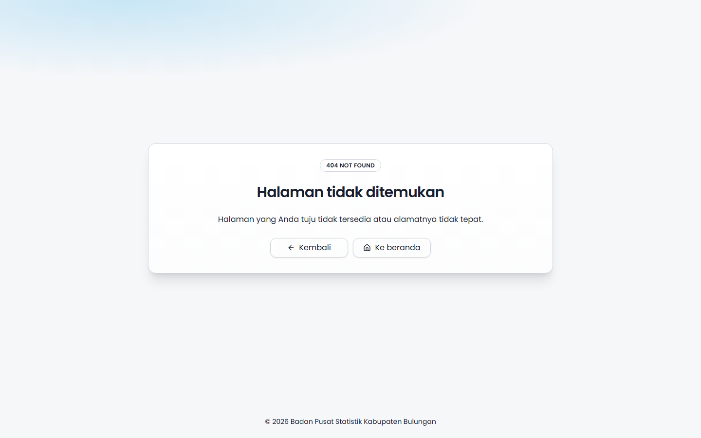
- Error 500

  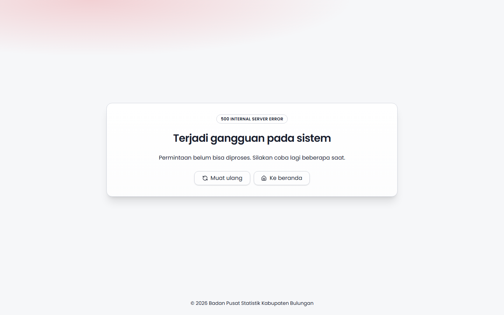

## Dukungan Light Mode dan Dark Mode

Aplikasi mendukung dua mode tampilan (`light` dan `dark`) dengan komponen UI yang konsisten di seluruh halaman publik dan admin. Perpindahan tema tersedia melalui `ThemeToggle` dan preferensi tema disimpan di browser.

| Light Mode                                              | Dark Mode                                             |
| ------------------------------------------------------- | ----------------------------------------------------- |
|      |      |
|  |  |

## Menu Aplikasi

| Menu                             | Fungsi                                | Apa yang Bisa Dilakukan User                                                                                                             |
| -------------------------------- | ------------------------------------- | ---------------------------------------------------------------------------------------------------------------------------------------- |
| Dashboard (`/admin/dashboard`) | Pusat monitoring operasional          | Memantau status bot, melihat metrik jadwal, membuka log aktivitas, mengecek pengiriman berikutnya, dan menjalankan kontrol bot.          |
| Kontak (`/admin/contacts`)     | Manajemen penerima pengingat WhatsApp | Menambah, mengubah, menghapus kontak, mencari data, mengubah status kontak, serta menjalankan aksi massal.                               |
| Kalender (`/admin/holidays`)   | Manajemen tanggal khusus              | Menandai hari libur nasional dan cuti bersama, melihat agenda per bulan, serta menghapus event kalender.                                 |
| Templat (`/admin/templates`)   | Manajemen isi pesan utama             | Mengedit template pesan, menyisipkan placeholder `{name}` dan `{quote}`, melihat pratinjau, menyalin hasil, dan menyimpan perubahan. |
| Kutipan (`/admin/quotes`)      | Manajemen daftar kutipan harian       | Menambah, mengedit, menghapus kutipan, mencari kutipan, dan memantau batas karakter konten.                                              |
| Login (`/admin/login`)         | Gerbang autentikasi admin             | Masuk ke area admin dengan kredensial yang valid dan redirect otomatis ke halaman admin yang dituju.                                     |
| Public Page (`/`)              | Transparansi status layanan           | Melihat status bot, ringkasan operasional, log aktivitas publik, statistik 7 hari, dan jadwal pengiriman default.                        |

## Installation

### 1) Clone repository

```bash
git clone https://github.com/bpskabbulungan/sigap-6502.git
cd sigap-6502
```

### 2) Install dependencies

```bash
npm install
```

### 3) Setup environment

Buat file environment backend dari contoh:

```bash
cp backend/.env.example backend/.env
```

Nilai minimum yang wajib dipastikan di `backend/.env`:

```env
PORT=3301
WEB_APP_URL=http://localhost:5174
TIMEZONE=Asia/Makassar

ADMIN_USERNAME=admin
ADMIN_PASSWORD=change_me
SESSION_SECRET=ganti_dengan_secret_aman
CONTROL_API_KEY=ganti_dengan_api_key_aman
```

Buat file `frontend/.env` secara manual:

```env
VITE_API_BASE_URL=http://localhost:3301
```

### 4) Run development mode

```bash
npm run dev
```

Akses aplikasi:

- Backend API: `http://localhost:3301`
- Frontend: `http://localhost:5174`

### 5) Build production assets

```bash
npm run build
```

### 6) Start aplikasi (mode production-like)

Jalankan backend dan frontend preview pada terminal terpisah:

```bash
npm --workspace backend run start
```

```bash
npm --workspace frontend run preview -- --host 0.0.0.0 --port 4173
```

Akses hasil start:

- Backend: `http://localhost:3301`
- Frontend preview: `http://localhost:4173`

## Scripts

### Root workspace (`package.json`)

| Script                   | Keterangan                                       |
| ------------------------ | ------------------------------------------------ |
| `npm run dev`          | Menjalankan backend dan frontend bersamaan.      |
| `npm run dev:backend`  | Menjalankan backend saja (nodemon).              |
| `npm run dev:frontend` | Menjalankan frontend saja (Vite dev server).     |
| `npm run build`        | Build backend + frontend workspace.              |
| `npm run test`         | Menjalankan test backend + frontend.             |
| `npm run lint`         | Menjalankan lint backend + frontend.             |
| `npm run check:lf`     | Validasi line ending script shell.               |
| `npm run postinstall`  | Menjalankan `patch-package` setelah instalasi. |

### Backend (`backend/package.json`)

| Script                                | Keterangan                                                    |
| ------------------------------------- | ------------------------------------------------------------- |
| `npm --workspace backend run start` | Menjalankan backend production mode (`node src/server.js`). |
| `npm --workspace backend run dev`   | Menjalankan backend development mode (`nodemon`).           |
| `npm --workspace backend run build` | Placeholder build backend.                                    |
| `npm --workspace backend run lint`  | Lint source backend.                                          |
| `npm --workspace backend run test`  | Test backend.                                                 |

### Frontend (`frontend/package.json`)

| Script                                              | Keterangan                             |
| --------------------------------------------------- | -------------------------------------- |
| `npm --workspace frontend run dev`                | Menjalankan frontend development mode. |
| `npm --workspace frontend run build`              | Build frontend production bundle.      |
| `npm --workspace frontend run preview`            | Menjalankan preview build frontend.    |
| `npm --workspace frontend run lint`               | Lint source frontend.                  |
| `npm --workspace frontend run test`               | Test frontend.                         |
| `npm --workspace frontend run test:visual`        | Menjalankan visual test Playwright.    |
| `npm --workspace frontend run test:visual:update` | Update snapshot visual test.           |

## Struktur Project

```bash
sigap-6502/
|- backend/
|- frontend/
|  |- src/
|  |  |- pages/        # app/
|  |  |- components/   # components/
|  |  |- lib/          # lib/
|  |  |- queries/      # hooks data fetching
|  |  |- utils/        # hooks/helper utilitas
|  |- public/          # public/
|- docs/
|  |- images/          # screenshot dokumentasi GitHub
|- scripts/
|- README.md
```

## Kredit

Semoga dokumentasi ini membantu. Jika ingin melakukan replikasi, kolaborasi, atau ada pertanyaan, silakan menghubungi tim IPDS BPS Kabupaten Bulungan.
